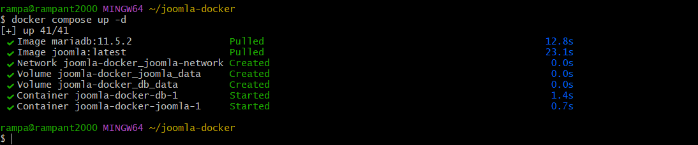
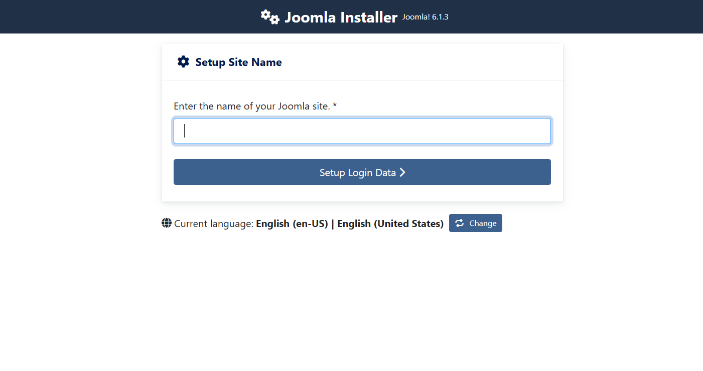
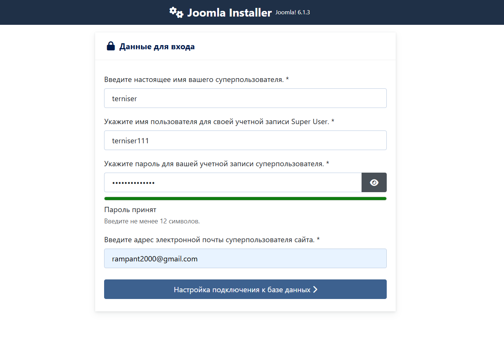
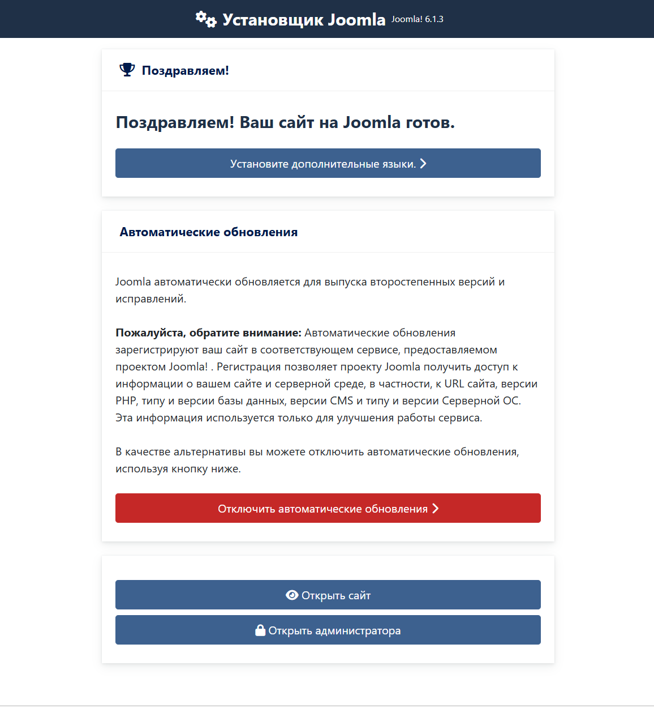
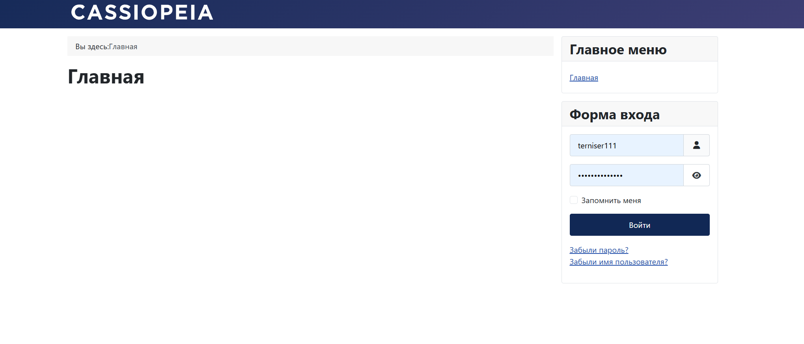
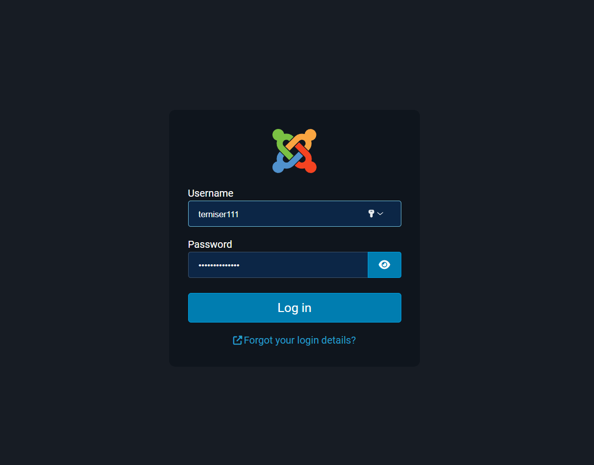
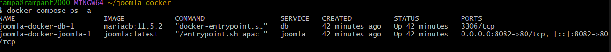
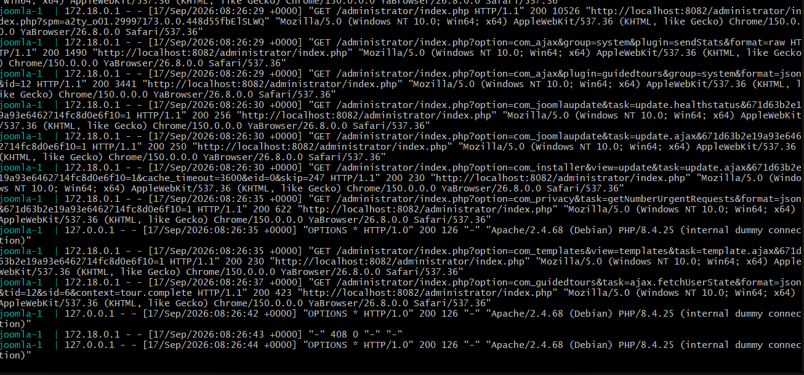

# 01. Joomla + MariaDB

Развёртывание Joomla CMS с базой данных MariaDB через Docker Compose.

## Задание

Источник: [content/Docker/DockerCompose/joomla.md](https://gitflic.ru/project/rurewa/mfua/blob?file=content/Docker/DockerCompose/joomla.md&branch=master)

## Что сделано

- Создан `compose.yaml` с двумя сервисами:
  - **db** — MariaDB 11.5.2, volume `db_data`, БД `joomla_db`
  - **joomla** — Joomla latest, порт `8082:80`, volume `joomla_data`
- Оба сервиса в общей сети `joomla-network`
- Проект запущен: `docker compose up -d`
- Пройден веб-мастер установки Joomla
- Удалена папка `installation` после установки

## Команды

```bash
docker compose ls
docker compose up -d
docker compose ps -a
docker compose logs -f joomla
docker compose logs db
docker compose config
docker compose stop
docker compose start
docker compose restart
docker compose down -v
```

## Доступ

- Сайт: http://localhost:8082
- Админка: http://localhost:8082/administrator

## Скриншоты

### 1. Мастер установки Joomla


### 2. Установщик Joomla


### 3. Установщик — настройка БД


### 4. Сайт Joomlapng


### 5. Админ-панель


### 6. Статус контейнеров


### 7. Логи


### 8. Запуск проекта


