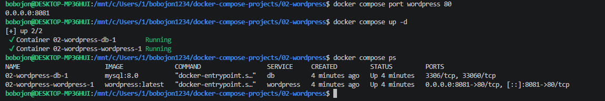
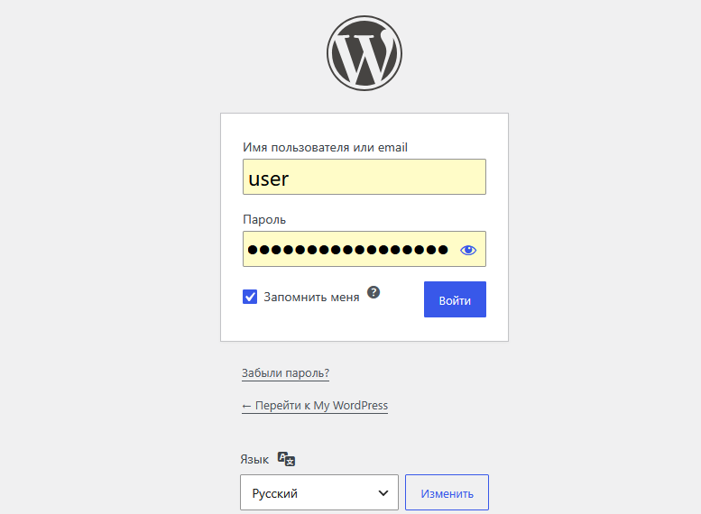
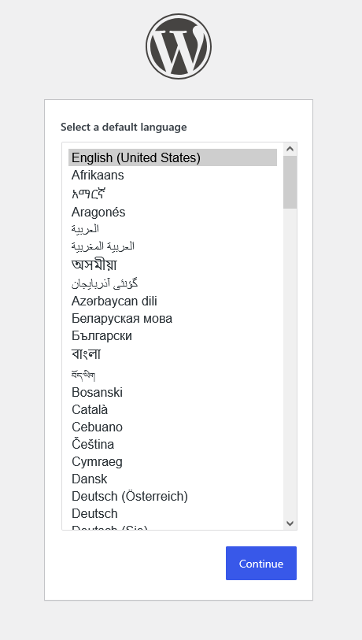
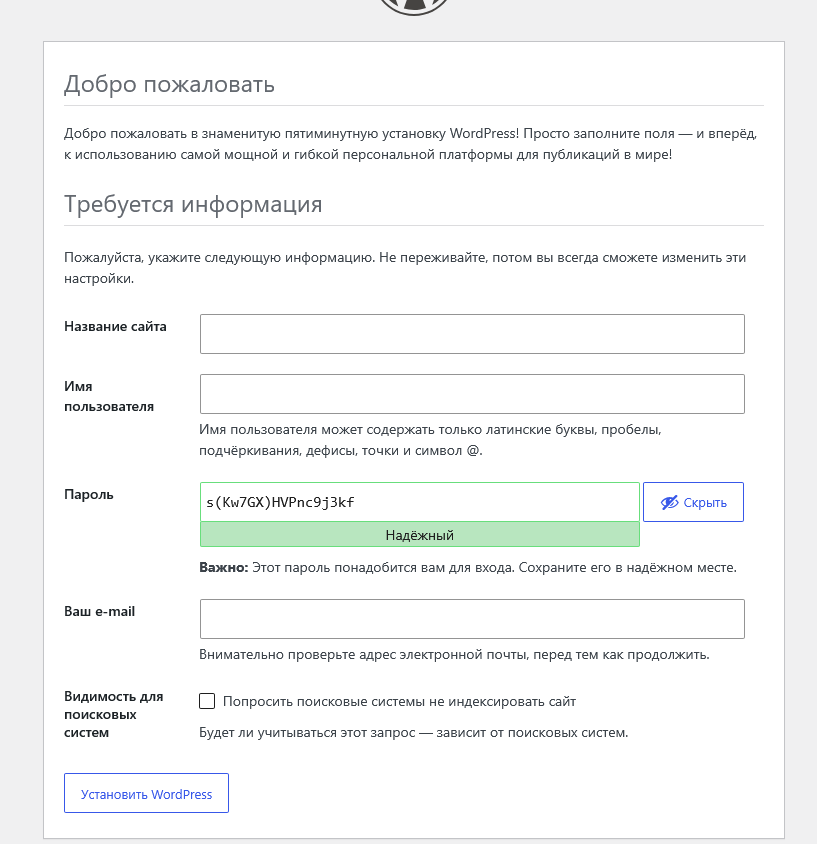
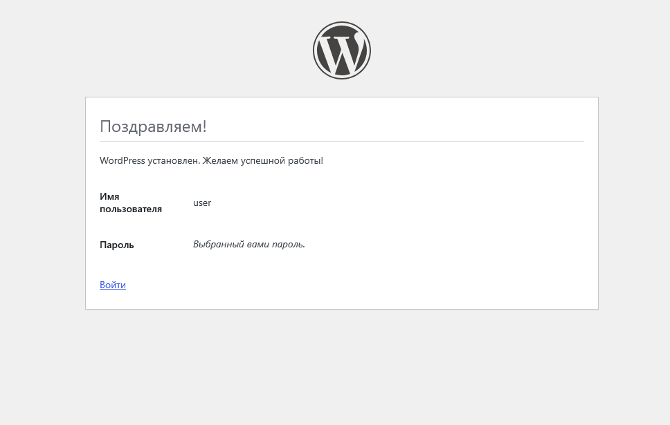
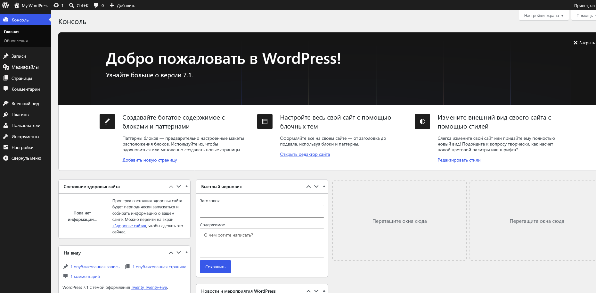

# 02. WordPress + MySQL

Развёртывание WordPress CMS с базой данных MySQL через Docker Compose.

## Задание

Источник: [content/Docker/DockerCompose/WordPress.md](https://gitflic.ru/project/rurewa/mfua/blob?file=content/Docker/DockerCompose/WordPress.md&branch=master)

## Что сделано

- Создан `compose.yaml` с двумя сервисами:
  - **db** — MySQL 8.0, volume `db_data`, БД `wordpress`
  - **wordpress** — WordPress latest, порт `8081:80`, volume `wordpress_data`
- Оба сервиса в общей сети `wp-network`
- Проект запущен: `docker compose up -d`
- Пройдена установка WordPress через веб-интерфейс
- Настроены логин/пароль администратора, создан сайт

## Команды

```bash
docker compose ls
docker compose up -d
docker compose ps -a
docker compose logs -f wordpress
docker compose logs db
docker compose config
docker compose stop
docker compose start
docker compose restart
docker compose down
docker compose down -v
```

## Доступ

- Сайт: http://localhost:8081
- Админка: http://localhost:8081/wp-admin

## Скриншоты

### 1. Запуск проекта


### 2. Статус контейнеров


### 3. Выбор языка установщика


### 4. Форма установки


### 5. Завершение установки


### 6. Главная страница сайта
