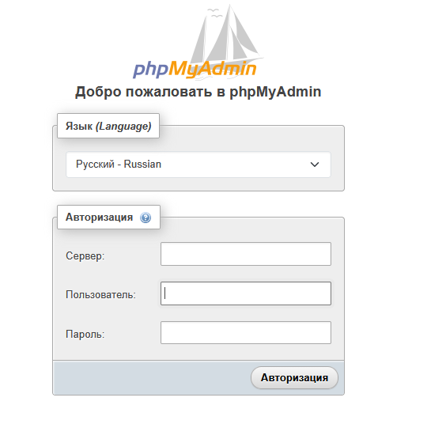
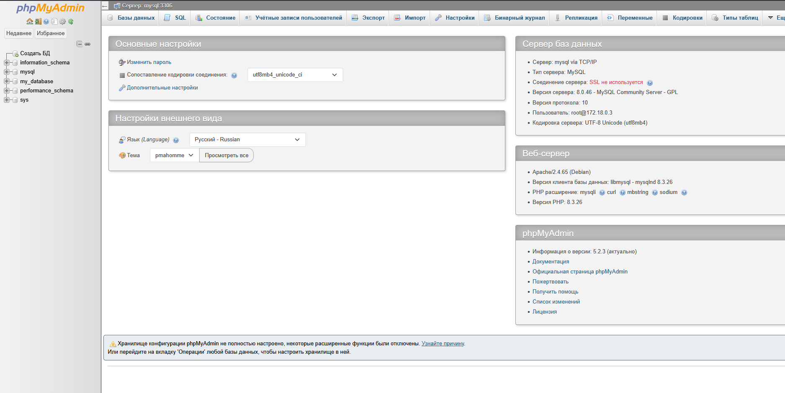
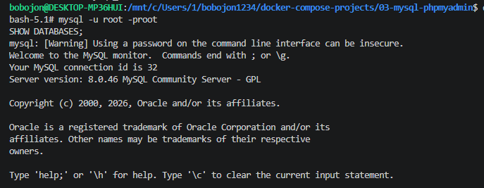

# 03. MySQL + phpMyAdmin

Развёртывание MySQL с веб-интерфейсом phpMyAdmin через Docker Compose.

## Задание

Источник: [content/Docker/DockerCompose/mySQLphpMyAdmin.md](https://gitflic.ru/project/rurewa/mfua/blob?file=content/Docker/DockerCompose/mySQLphpMyAdmin.md&branch=master)

## Что сделано

- Создан `compose.yaml` с двумя сервисами:
  - **mysql** — MySQL 8.0, порт `3306:3306`, volume `mysql_data`, БД `my_database`, пользователь `my_user`
  - **phpmyadmin** — phpMyAdmin latest, порт `8083:80`
- Оба сервиса в общей сети `mysql-pma-network`
- Проект запущен: `docker compose up -d`
- Оба контейнера в статусе **Up** (проверено `docker compose ps`)
- Выполнен вход в phpMyAdmin по адресу http://localhost:8083 (`root` / `root`)
- В phpMyAdmin доступен список баз данных: `my_database`, `information_schema`, `mysql`, `performance_schema`, `sys`

## Команды

```bash
docker compose ls
docker compose up -d
docker compose ps -a
docker compose logs -f phpmyadmin
docker compose logs -f mysql
docker compose config
docker compose stop
docker compose start
docker compose restart
docker compose exec mysql bash
docker compose down
docker compose down -v
```

## Доступ

- phpMyAdmin: http://localhost:8083
- MySQL: localhost:3306
- Логин: `root` / `root` (или `my_user` / `my_password`)

## Скриншоты

### 1. Форма входа phpMyAdmin



### 2. phpMyAdmin — список баз данных

После входа под `root` доступен список БД, включая созданную автоматически `my_database`:



### 3. Работа в терминале

Запуск проекта, проверка статуса контейнеров, вход в MySQL-контейнер:

