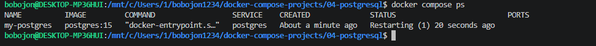
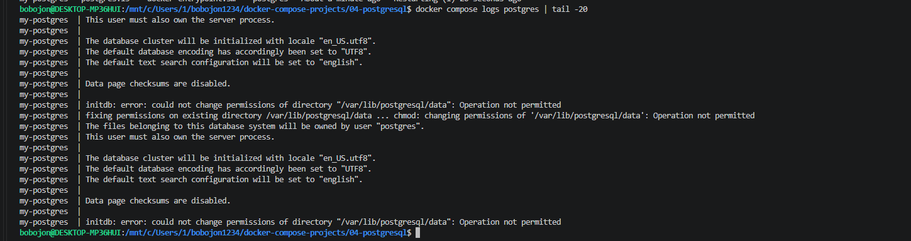
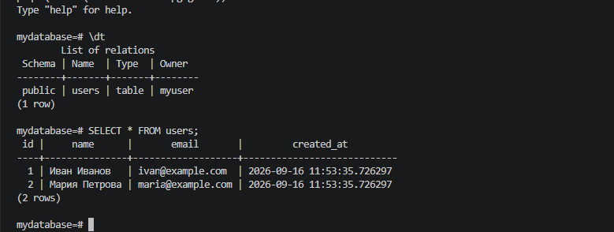

# 04. PostgreSQL

Развёртывание PostgreSQL 15 через Docker Compose с инициализацией через `init.sql`, healthcheck и bind-mounts.

## Задание

Источник: [content/Docker/DockerCompose/PostgresSQL.md](https://gitflic.ru/project/rurewa/mfua/blob?file=content/Docker/DockerCompose/PostgresSQL.md&branch=master)

## Что сделано

- Создан `compose.yaml` с сервисом **postgres**:
  - Образ `postgres:15`, container_name `my-postgres`
  - Порты: `5432:5432`
  - БД `mydatabase`, пользователь `myuser`, пароль `mypassword`
- Настроены bind-mounts:
  - `./scripts/init.sql` → `/docker-entrypoint-initdb.d/init.sql` (инициализация)
  - `./backups` → `/backups` (папка для бэкапов)
- Настроен `healthcheck` через `pg_isready`
- Проект запущен: `docker compose up -d`
- Проверено подключение через `psql`: таблица `users` создана, тестовые данные (Иван Иванов, Мария Петрова) вставлены

## Команды

```bash
docker compose ls
docker compose up -d
docker compose ps
docker compose logs postgres
docker compose config
docker compose stop
docker compose start
docker exec -it my-postgres psql -U myuser -d mydatabase
docker compose down
docker compose down -v
```

## Доступ

- PostgreSQL: `localhost:5432`
- БД: `mydatabase`, пользователь: `myuser`, пароль: `mypassword`

## Скриншоты

### 1. Запуск проекта


### 2. Статус контейнера


### 3. Логи PostgreSQL


### 4. Попытка подключения / промежуточный шаг


### 5. Подключение к БД и таблица `users`
