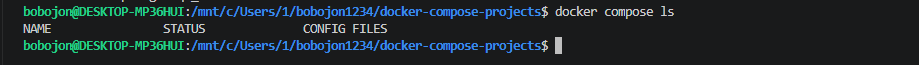
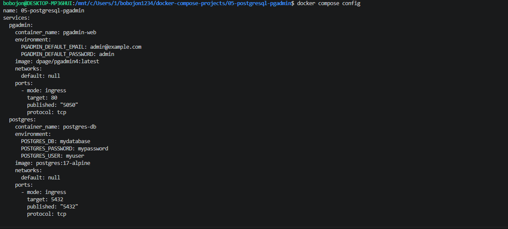
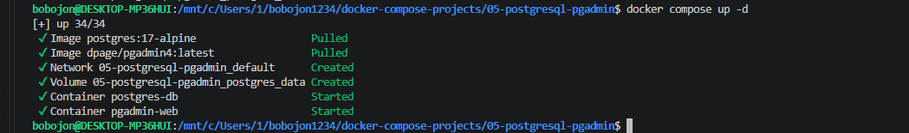
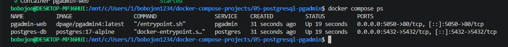
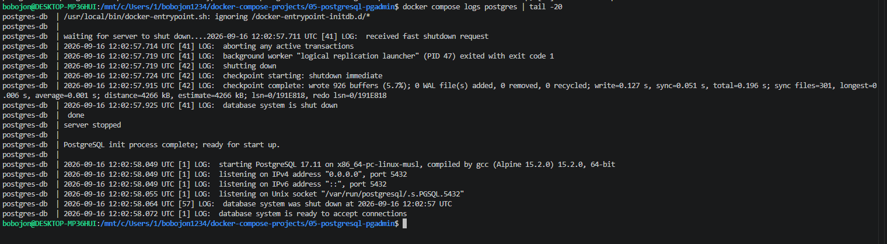
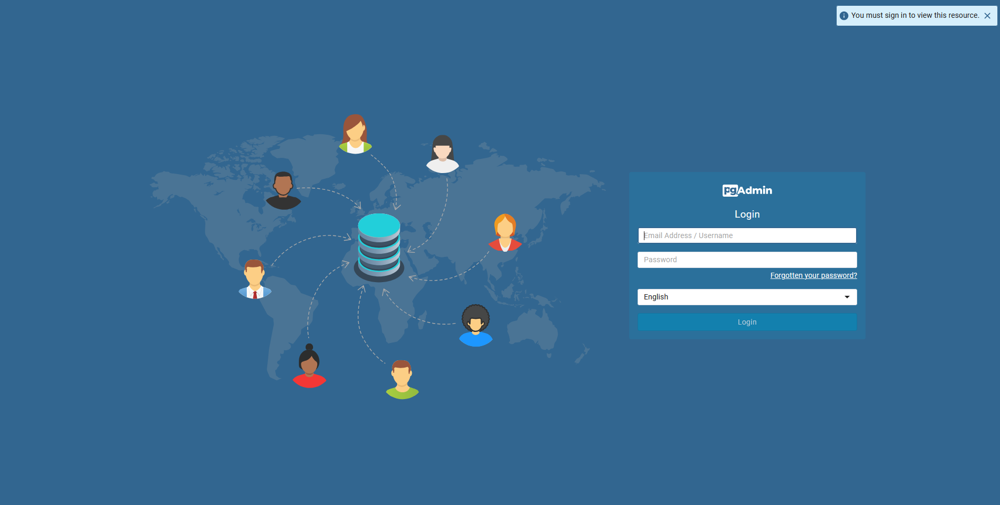
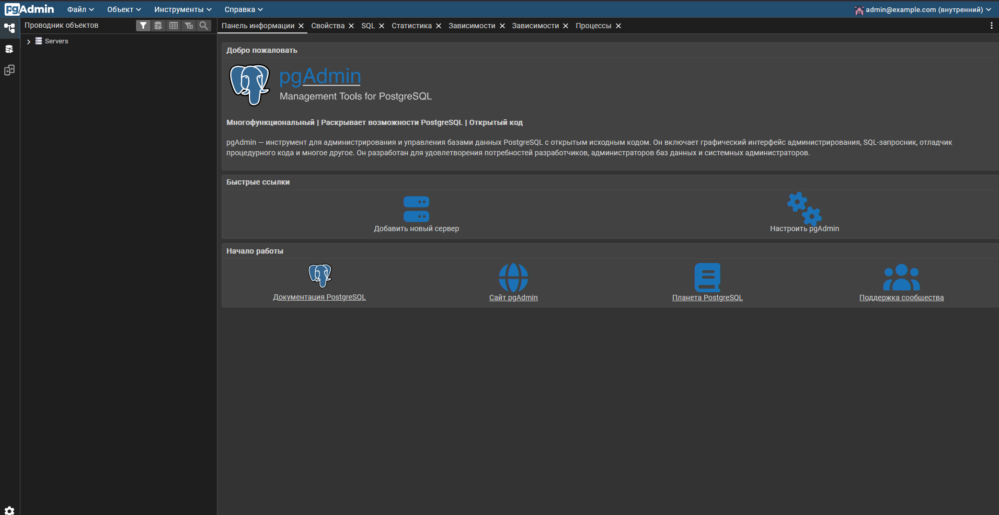
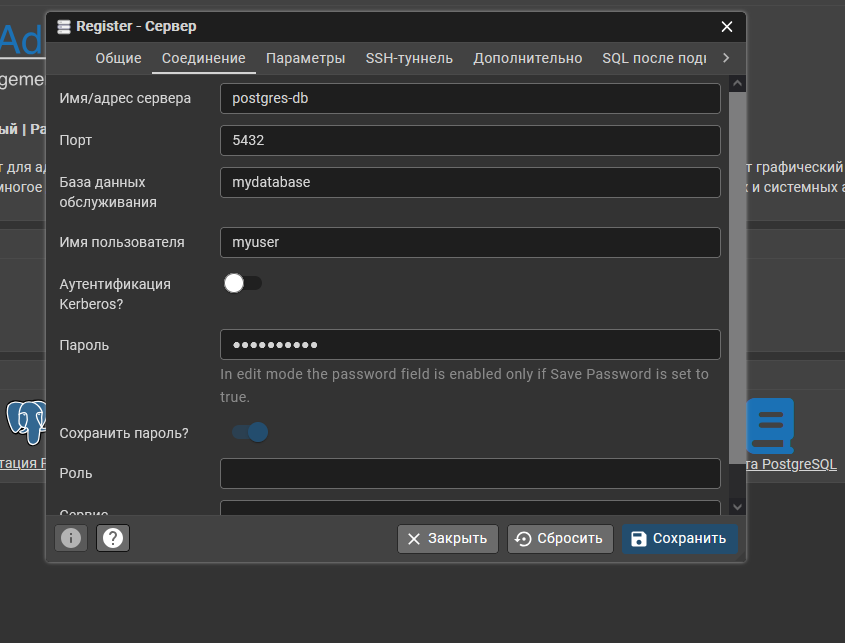
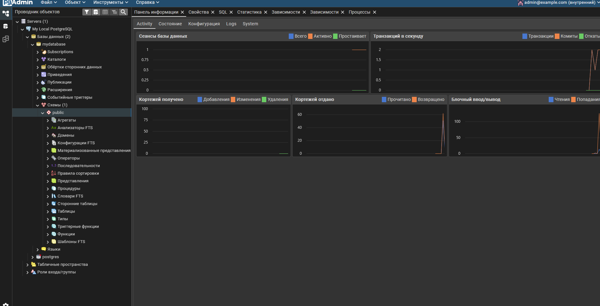
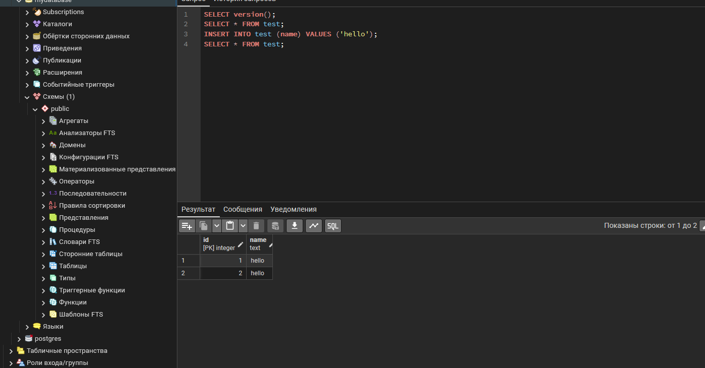

# 05. PostgreSQL + pgAdmin

Развёртывание PostgreSQL 17 с веб-интерфейсом pgAdmin 4 через Docker Compose.

## Задание

Источник: [content/Docker/DockerCompose/PostgreSQL_pgAdmin.md](https://gitflic.ru/project/rurewa/mfua/blob?file=content/Docker/DockerCompose/PostgreSQL_pgAdmin.md&branch=master)

## Что сделано

- Создан `compose.yaml` с двумя сервисами:
  - **postgres** — `postgres:17-alpine`, container_name `postgres-db`, порт `5432:5432`, volume `postgres_data`, БД `mydatabase`, пользователь `myuser`
  - **pgadmin** — `dpage/pgadmin4:latest`, container_name `pgadmin-web`, порт `5050:80`, email `admin@example.com`
- Проект запущен: `docker compose up -d`
- Выполнен вход в pgAdmin по http://localhost:5050
- Настроено подключение pgAdmin к PostgreSQL:
  - Host: `postgres-db`
  - Port: `5432`
  - Database: `mydatabase`
  - User: `myuser`
- Проверено выполнение SQL-запроса через Query Tool

## Команды

```bash
docker compose ls
docker compose up -d
docker compose ps -a
docker compose logs -f pgadmin
docker compose logs -f postgres
docker compose config
docker compose stop
docker compose start
docker compose restart
docker compose exec postgres bash
docker compose down
docker compose down -v
```

## Доступ

- pgAdmin: http://localhost:5050 — `admin@example.com` / `admin`
- PostgreSQL: `localhost:5432` — БД `mydatabase`, пользователь `myuser`, пароль `mypassword`

## Скриншоты

### 1. Проверка активных проектов


### 2. Конфигурация


### 3. Запуск проекта


### 4. Статус контейнеров


### 5. Логи PostgreSQL


### 6. Форма входа pgAdmin


### 7. pgAdmin — главный экран


### 8. Регистрация сервера PostgreSQL


### 9. pgAdmin подключён к PostgreSQL


### 10. SQL-запрос через Query Tool
