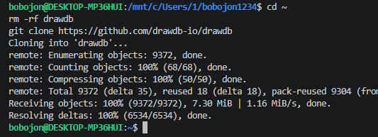
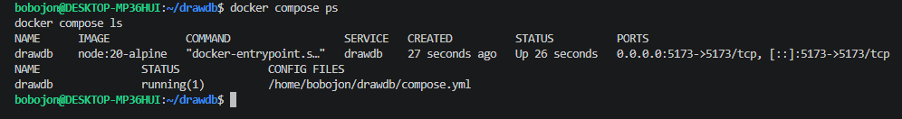
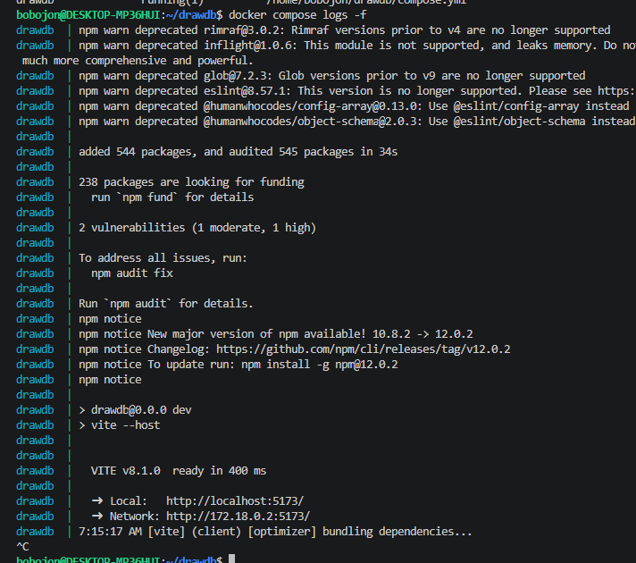
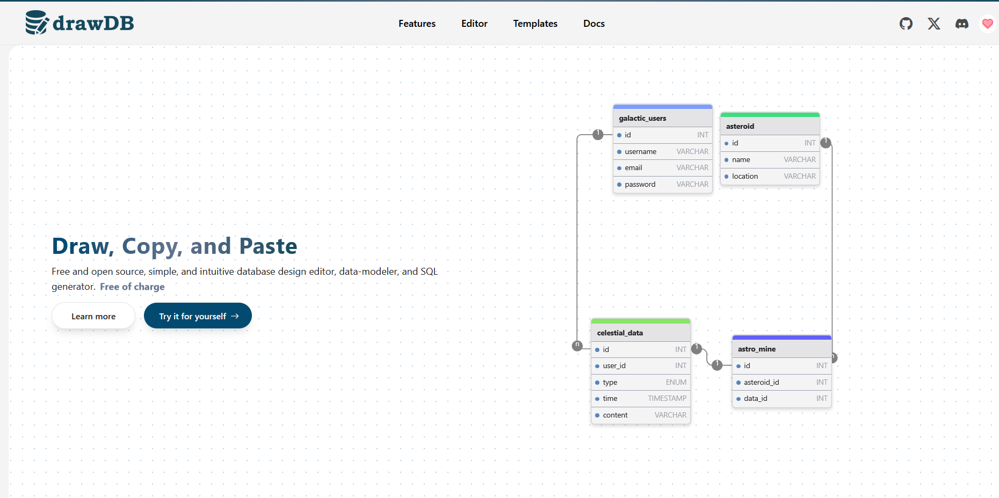
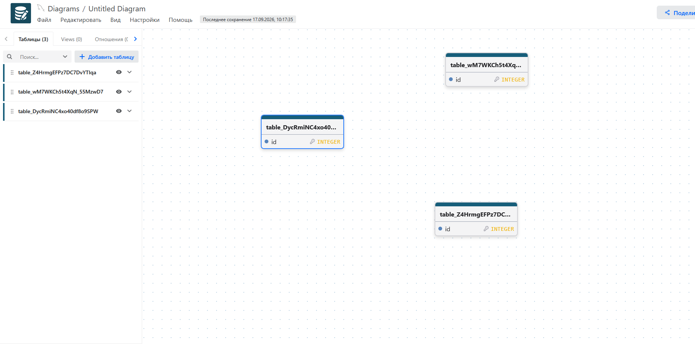

# 06. drawDB

Развёртывание редактора ER-диаграмм drawDB из upstream-репозитория.

## Задание

Источник: [content/Docker/DockerCompose/drawDB.md](https://gitflic.ru/project/rurewa/mfua/blob?file=content/Docker/DockerCompose/drawDB.md&branch=master)
Upstream: [github.com/drawdb-io/drawdb](https://github.com/drawdb-io/drawdb)

## Что сделано

- Клонирован репозиторий drawDB в домашнюю папку WSL: `git clone https://github.com/drawdb-io/drawdb`
- Запущен родной `compose.yml` из upstream: `docker compose up -d`
- Контейнер `drawdb` собран из исходников (`npm install && npm run dev -- --host`)
- Приложение доступно по адресу `http://localhost:5173` (Vite dev-сервер)
- Открыт веб-интерфейс drawDB, построена тестовая ER-диаграмма

## Команды

```bash
cd ~
git clone https://github.com/drawdb-io/drawdb
cd drawdb
docker compose up -d
docker compose ps
docker compose ls
docker compose logs -f
docker compose down -v
```

## Доступ

- drawDB UI: http://localhost:5173

## Скриншоты

### 1. Проверка активных проектов


### 2. Клонирование репозитория


### 3. Запуск проекта


### 4. Статус контейнеров


### 5. Логи — Vite ready


### 6. Интерфейс drawDB


### 7. ER-диаграмма
