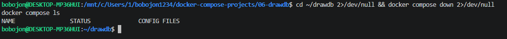
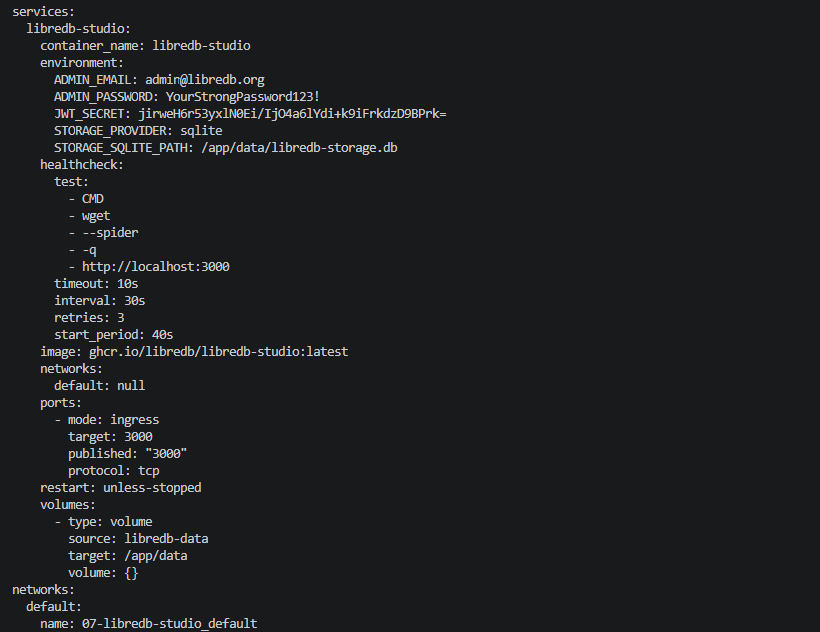
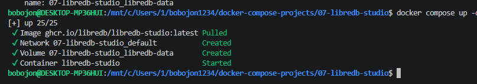
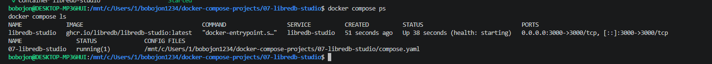
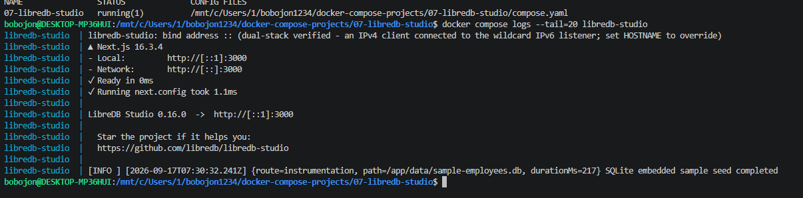
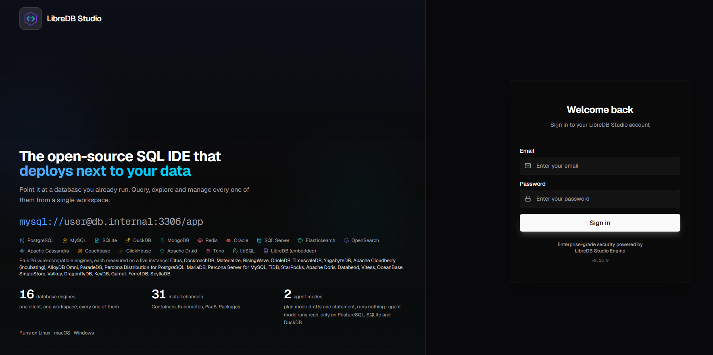
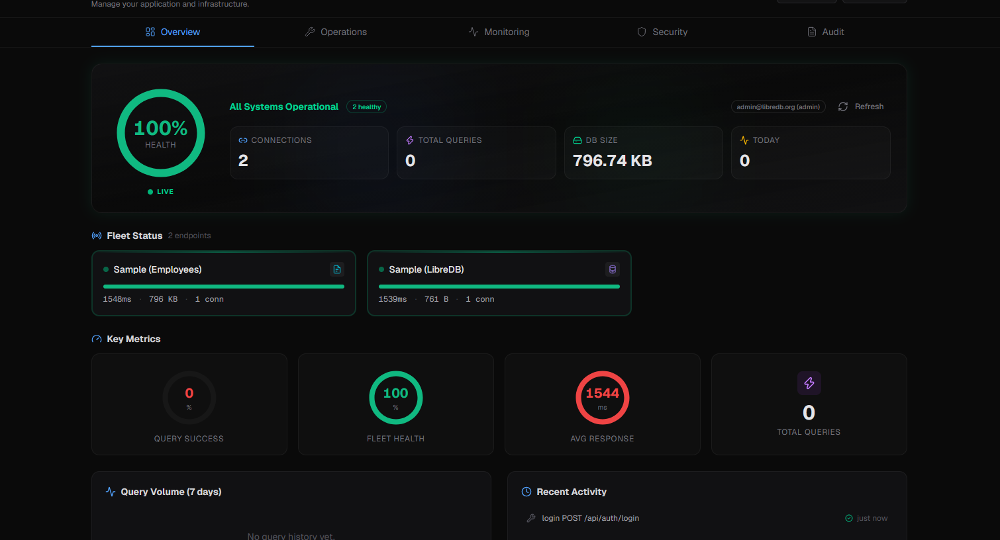
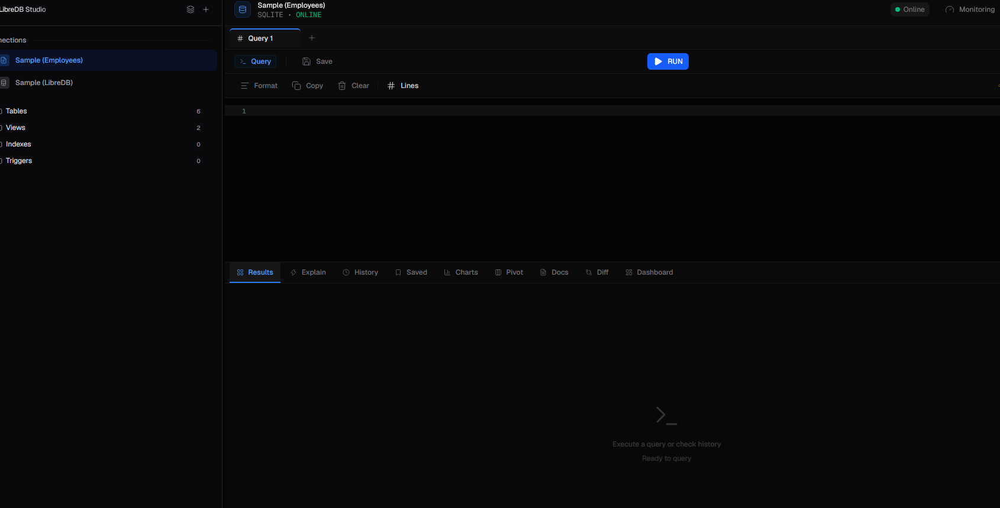

# 07. LibreDB Studio

Развёртывание веб-IDE для работы с базами данных LibreDB Studio через Docker Compose.

## Задание

Источник: [content/Docker/DockerCompose/LibreDB_Studio.md](https://gitflic.ru/project/rurewa/mfua/blob?file=content/Docker/DockerCompose/LibreDB_Studio.md&branch=master)

## Что сделано

- Создан `compose.yaml` с сервисом **libredb-studio**:
  - Образ `ghcr.io/libredb/libredb-studio:latest`
  - Порт `3000:3000`
  - Volume `libredb-data` → `/app/data`
  - Healthcheck через `wget --spider http://localhost:3000`
- Создан `.env` с обязательными переменными: `ADMIN_EMAIL`, `ADMIN_PASSWORD`, `JWT_SECRET`
- Проект запущен: `docker compose up -d`
- Встроенная SQLite-база `sample-employees.db` засеялась автоматически
- Выполнен вход в веб-интерфейс по адресу http://localhost:3000
- Проверена работа SQL-редактора

## Команды

```bash
docker compose ls
ss -tulpn | grep :3000
docker ps -a | grep libredb-studio
docker compose config
docker compose up -d
docker compose ps -a
docker compose logs --tail=20 libredb-studio
docker compose logs -f
docker compose down -v
docker image rm ghcr.io/libredb/libredb-studio:latest
```

## Доступ

- LibreDB Studio: http://localhost:3000
- Логин: `admin@libredb.org` / `YourStrongPassword123!`

## Файлы проекта

- `compose.yaml` — конфигурация сервиса
- `.env` — переменные окружения (email, password, JWT_SECRET)

## Скриншоты

### 1. Проверка активных проектов


### 2. Конфигурация


### 3. Запуск проекта


### 4. Статус контейнера


### 5. Логи


### 6. Страница входа


### 7. Главный экран


### 8. SQL-редактор
